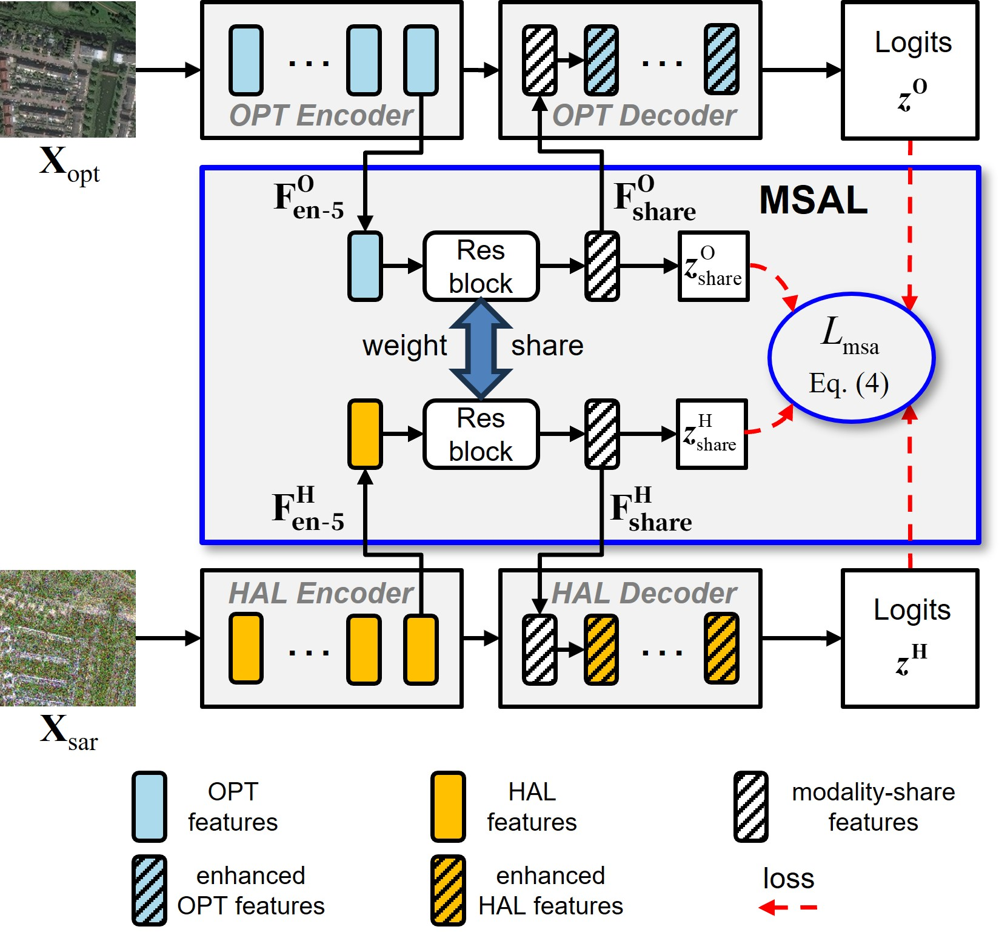
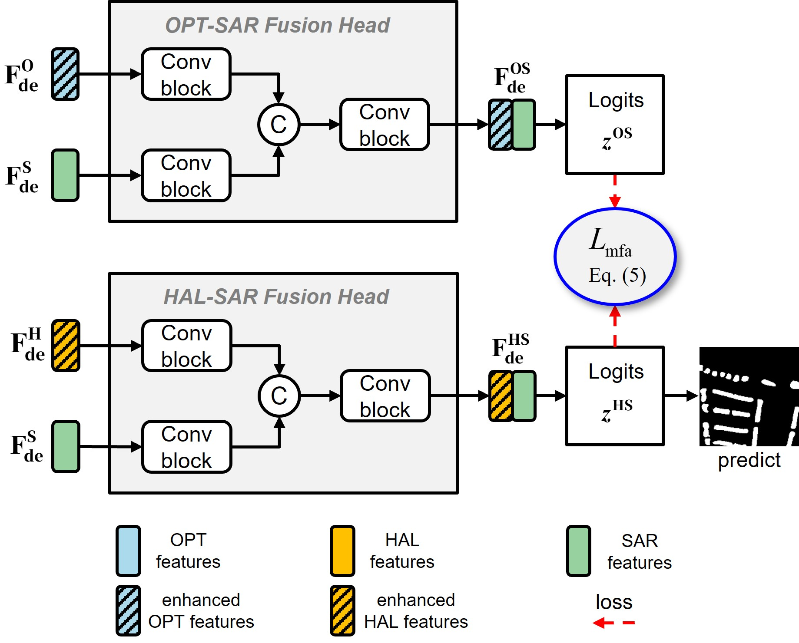

# Optical and SAR Cross-modal Hallucination Collaborative Learning for Remote Sensing Missing-modality Building Footprint Extraction

## Abstract

Building footprint extraction using optical and synthetic aperture radar (SAR) images enables all-weather capability and significantly boosts performance.
In practical scenarios, optical data may not be available, leading to the missing-modality challenge.
To overcome this challenge, advanced methods employ mainstream knowledge distillation approaches with hallucination network schemes to improve performance.
However, under complex SAR backgrounds, current hallucination network-based methods suffer from cross-modal information transfer failure between optical and hallucination models.
To solve this problem, this study introduces a cross-modal hallucination collaborative learning (CMH-CL) method, consisting of two components: modality-share information alignment learning (MSAL) and multimodal fusion information alignment learning (MFAL).
The MSAL method facilitates cross-modal knowledge transfer between optical and hallucination encoders, thereby enabling the hallucination model to effectively mimic the missing optical modality. 
The MFAL method aligns semantic information between OPT-SAR and HAL-SAR fusion heads to strengthen their semantic consistency, thereby improving HAL-SAR fusion performance. 
By combining MSAL and MFAL, the CMH-CL method collaboratively alleviates cross-modal transfer failure problem between the optical and hallucination models, thereby improving performance in missing-modality building footprint extraction.
Extensive experimental results obtained on a public dataset demonstrate the effectiveness of the proposed CMH-CL.

## Overview

### Pipeline

  

### MSAL and MFAL

|                  MSAL                  |                  MFAL                  |
|:--------------------------------------:|:--------------------------------------:|
|  |  |

